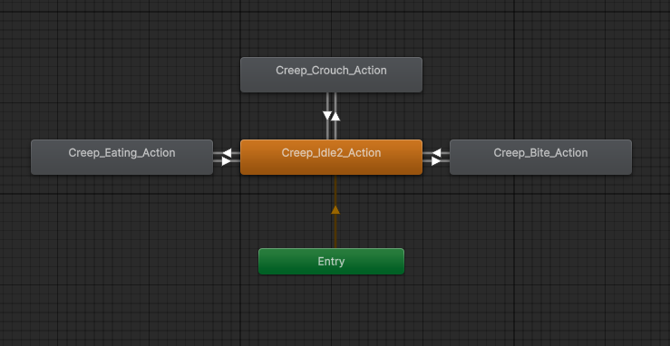
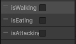

## 🎮 Feed the Beast

## 📌 Overview
Feed the Beast is a survival horror/PvP cooking game where two players will fight for their survival by cooking meals for a frightening monster

## 🕹️ Core Gameplay
Two players will be assigned the role of chefs tasked with feeding a big scary beast. Each night they will prepare a meal for the monster, and the monster will choose which meal it likes better. Whoever makes the worst meal, the monster will take a bite out of them. After a player has been bit 3 times, they lose, and the other player wins. The core gameplay will consist of the two players assembling a meal with ingredients scattered around the environment. To assemble the meal, they will place the ingredients on a plate. Their movement will consist of holding ingredients and running/walking.

## 🎯 Game Type
This will be a Player-vs-Player survival horror game, with some cooking elements.

## 👥 Player Setup
There are two players in the game– locally connected. The two players are responsible for the same core gameplay mentioned above, however they will be working against each other for their own survival. Currently, the scope of our project is to be developed with the idea of two players playing split-screen on the same device. However, if it fits in our timeline, we’d like to include an online multiplayer option so that players can join from different devices and only have their own character’s point of view on their screen. Online connection would entail a user sharing a private code for their player two to join with. Each player will only be able to see a small portion of the overall map. Players will be able to navigate around the map using the WASD keys and perform actions like picking up, cooking, and serving.

## 🤖 AI Design
### Monster FSM
- Idle
- Moving towards food
- Sniffing food (this is where decision making algorithm is run)
- Moving towards target
- Attacking target
- Going to sleep

### Monster FSM - Summary
- Every round the pet (our AI enemy) will start out in the idle state. After one minute it will show up in the environment. It will then enter a moving state where it will use pathfinding to walk to the prepared meals. Once the destination is reached, it will enter another state where it appears to be smelling the prepared meals, but really it will be using a decision making algorithm to decide which of the meals it likes better. After this is decided, it will re-enter the moving state, where it will use pathfinding to walk to the player who made the worse meal. It will then enter an attack state and take a bite of that player. Finally, once the player has been bitten, the pet will enter the moving state for the last time, where it will simply leave the room, starting the next round. If the pet didn’t like either meal, it will choose the player to bite based on random chance.

### Ingredient FSM
- Idle when spawned on a surface
- PickedUp set PlayerHandFree to False
- InMeal when added to a plate

## 🎬 Scripted Events
There are a few scripted events in our game. The first one is the pet heading to sleep, indicating the time to cook food for it begins. Along with the pet sleeping, there will be multiple audio cues to indicate how much time is left (30 seconds, 10 seconds etc.) and the pet will wake up at the end of the timer. The end of timer would have another scripted event– the pet waking up and observing both players created meals before deciding its own action.

At the start of the timer, food will also drop for both users to collect for preparation. This scripted event will determine randomly the quality of the ingredients given for the users to cook with. 

## 🌍 Environment and Assets
The game will take place in a dark and grimy kitchen or storage house. There will be at least 3 locations in the environment, which will be the two preparation areas for each player, and a room to store ingredients. The players will primarily be interacting with the ingredients within the environment to create their meals. Most visual assets for the game will be obtained from the Unity asset store. These assets will mainly be used to establish the game setting and props. We are also planning to use Blender to create our own models for some objects, like the beast. Any sound effects in the game will either be self-recorded or obtained from royalty-free websites.

## 🧪 Physics Scope
- Colliders on players, ingredients, environmental props
- Standard gravity physics on players and ingredients
- Ability for ingredients to slide around if pushed while on the floor
- Rigidbody on players, beast, and ingredients

## 🧠 FSM Scope
- FSM with idle, moving, decision making, and attacking states for the pet
- Pet will leave these states based on timers and events being triggered
- Each ingredient will have an inHand flag to determine whether or not it is being held
- When an ingredient is held it becomes parented to the player's hand
- Players will have handEmpty flag that gets triggered when they interact with an ingredient

## 🧩 Systems and Mechanics
- Ingredients will be scattered around the room at the start of the round
- A timer will start at the beginning of the round, when it ends the pet will leave its idle state
- Players will interact with ingredients to assemble a meal, each ingredient will either give points or subtract points from the meal (the players' score will be hidden to them)
- The pet will run a decision making algorithm to decide which player it will attack (this will be based on whoever scored higher, but if neither players score high enough the pet will pick by random)
- The camera will be controlled by a first person POV
- The timer will include a beeping sound effect in intervals when the time is running out
- Chomp sound effect will play when the pet bites a player

## 🎮 Controls (proposed)
- W A S D (movement)
- Mouse (look around)
- Space (jump) 
- E (pick up/drop ingredient)

## 📂 Project Setup
- Unity
- C# scripts for player, beast, and ingredient behaviour
- Github repository for game code
- JIRA board for task organization

## 💻 Group members
- Hashir Sami – Developer, Focus on player interaction with environment
- Jack Caldarone – Developer, Focus on main enemy/NPC
- Kristina Arabov – Developer, Focus on visuals/modelling and physics

## Assignment 2 - FSM

- The monster will start out in the idle state, which serves as the base which all states transition to/from
- From idle, the monster can transition to walking, eating, or attacking, all of which have their own distinct animations
- After an in-game timer goes off, the isWalking variable will be set to true, which will cause the monster to transition to the walking state
- Once it reaches the destination, isWalking will be set to false, and isEating will be set to true, meaning the monster will briefly re-enter the idle state before transitioning to the eating state
- This will repeat for the second bowl, and then the monster will move to the player (while in the walking state)
- Finally, the monster will briefly re-enter the idle state when isWalking is set to false, and will then enter the attacking state when isAttacking is set to true
- An attacking animation will play, and then the monster will return to its original position